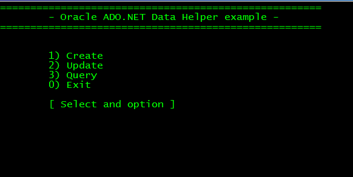
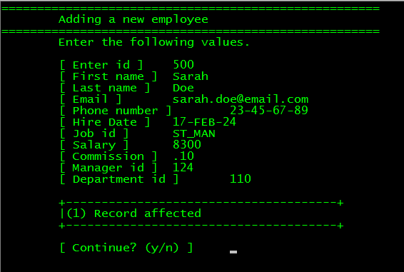
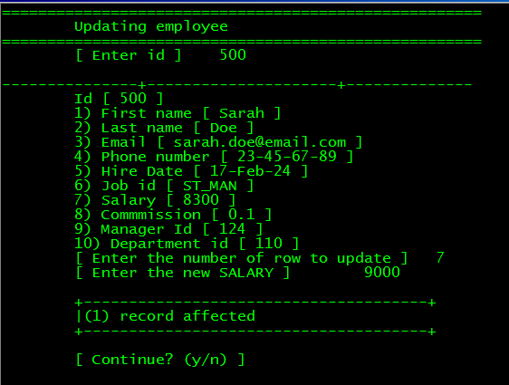
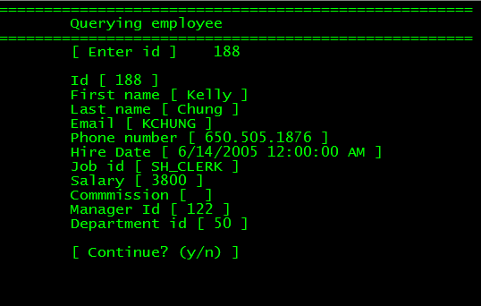

# ADO.NET Helper para Oracle (Update con el proveedor de Oracle para .NET)

Todos los programas que utilizan las clases e interfaces del proveedor predeterminado de ADO.NET para Oracle que se encuentran en el ensamblado System.Data.Oraclient deben actualizarse (a partir de la version del framework 4.0) por las clases e interfaces que se encuentran en el ensamblado Oracle.DataAccess.Client, que es el proveedor nativo de Oracle para ADO.NET.

Como ejemplo del uso de las clases de ADO.NET de Oracle, he contruido este Helper, cuya funcionalidad es tener los métodos CRUD para una entidad Employee.

He escrito una aplicación de consola que muestra el uso de la clases del Helper para implementar tres metodos CRUD, (Create,Retrieve, Update).

<b>Fig 1. Menu principal mostrando los metodos (Crear,Modificar y Consultar)</b>

 

<b>Fig 2. Crear un new empleado.</b>

 

<b>Fig 3. Consultar para modificar un empleado.</b>

 

<b>Fig 4. Consultar un empledo por Id.</b>

 

Este programa utiliza la base de datos HR de Oracle, la cual puede ser descargada aqui:

<a href="https://github.com/oracle-samples/db-sample-schemas">Oracle db samples</a>

